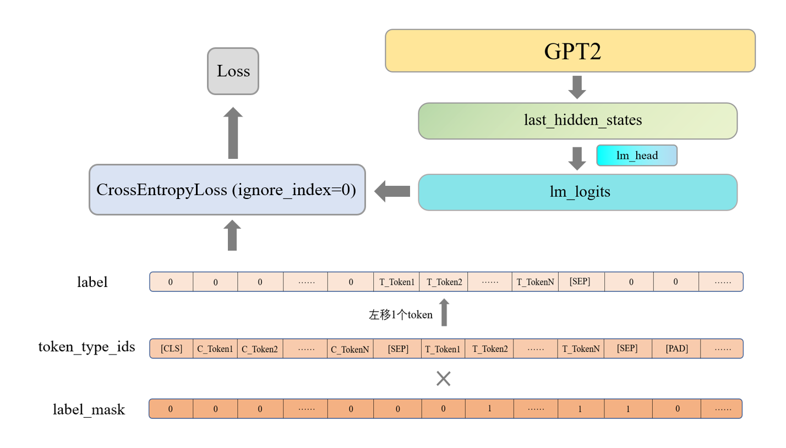

# 🚀智能创作平台使用方法

注：请先将模型文件下载至 `Back-end/mysite/data/` 目录。<br>链接：https://pan.baidu.com/s/1hBVIp5RNkvVeyS8TVufEaQ  提取码：asdf

## 🎒 前置需求

- Node.js >= 12.0.0

- Yarn

- 所需要的Python包（见back-end/mysite/requirements.txt)

  - ```shell
    pip install -r requirements.txt
    ```

## 🍔 安装

### 🍟前端

```shell
cd Front-end
yarn install
yarn start
```

现在你可以在浏览器中访问 <http://localhost:3000/>

### 🍟后端

```shell
cd Back-end/mysite
python manage.py runserver
```

**在summary/utli中存放摘要生成相关代码和模型在summary文件夹下的视图层view.py相关位置调用生成函数**

## 🚀功能简介

### 自动标题生成

#### 项目描述

根据文章内容生成文章标题

#### 环境配置

Python 版本：3.8
PyTorch 版本：1.10.0
CUDA 版本：11.3

所需环境在 `requirements.txt` 中定义。

#### 数据

* 软件杯官方数据 http://www.cnsoftbei.com/plus/view.php?aid=729
* 开源摘要数据 https://zhuanlan.zhihu.com/p/341398288

#### 目录结构

```
./
├── README.md
├── requirements.txt        # Python包依赖文件 
├── check/                  # 保存模型
├—— logs/                   # 保存tfevent文件
├── data/                   # 保存训练数据
│   ├── train.json
│   ├── dev.json
│   ├── ...
├── vocab/                  # 词表目录
│   ├── vovab.txt      # 用于构建tokenizer的词表
├—— config/   
│   ├── config.json         # 模型配置
├── src/                    # 核心代码
│   ├── config.py      # 模型、训练参数
│   ├── dataset.py     # 数据集
│   ├── finetune.py    # 微调
│   ├── generate.py    # 测试生成
│   ├── model.py       # 模型定义
│   ├── train.py       # 训练
│   ├── utils.py       # 工具函数
```

```
注：vocab.txt来自 https://huggingface.co/hfl/chinese-macbert-base/blob/main/vocab.txt
```

#### 模型

* GPT2
  

```
    注：
    1. N、M分别为内容和标题的最大长度。若超过最大长度，标题直接按最大长度截断，内容则分别截取最大长度一半的开头和结尾。  
    2. [Conetent] 和 [Title] 为添加的特殊字符，用于区分内容和标题片段。
```

* Loss
  

#### 生成测试


#### 运行流程

```shell
训练 -> 微调 -> 测试
```

```shell
pip install -r requirements.txt
python src/train.py
python src/finetune.py
python src/generate.py 
```

### 自动摘要生成

#### 需要的资源下载

由于使用的词向量表示和训练数据集过大，并没有作为提交文件的一部分提交，故如需在本地进行部署，请完成如下资源的下载：

+ 基于微博语料库训练的$300$维词向量
+ NLPCC2017摘要数据

#### 下载

* 基于微博语料库训练的$300$维词向量$300$维词向量，来源于https://github.com/Embedding/Chinese-Word-Vectors
  * 为加快下载，请从[此处](http://image-hosting-404.oss-cn-beijing.aliyuncs.com/source/sgns.weibo.word.zip)下载。
* `NLPCC2017`摘要数据，来源于https://github.com/liucongg/GPT2-NewsTitle
  * 为加快下载，请从[此处](http://image-hosting-404.oss-cn-beijing.aliyuncs.com/source/nlpcc_data.json)下载。

下载完成将如上资源放在目录`backend/textrank/data`中即可

- [x] textRank计算关键词
- [x] textRank计算关键句
- [x] web前端HTML界面
- [x] Django后端
- [x] transformer

- [x] 检查一个词在停用词表中 用字典树优化
- [x] 计算关键句中 用字典树优化
- [x] 更细粒度的分句
- [x] textrank可以进一步改进，如加入句子长度的惩罚，或者使用句向量判断相似性


#### 参考资料来源

* 停用词表来源：https://github.com/goto456/stopwords
* 清华数据集来源：http://thuctc.thunlp.org/
* 清华新闻数据集来源：https://thunlp.oss-cn-qingdao.aliyuncs.com/THUCNews.zip


