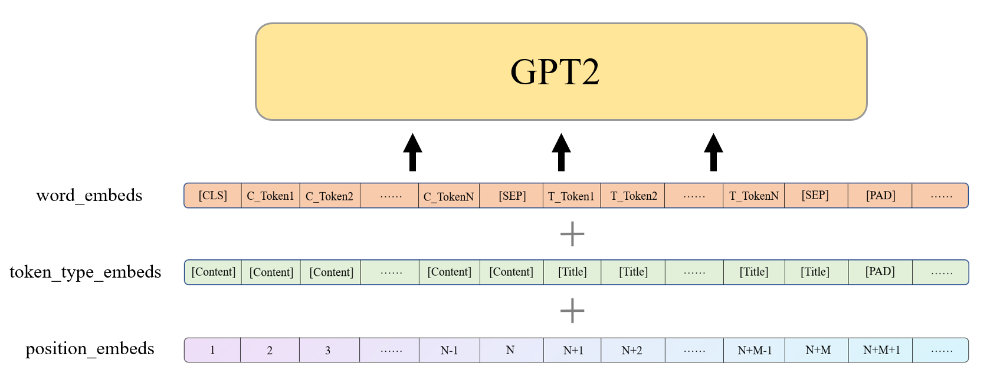
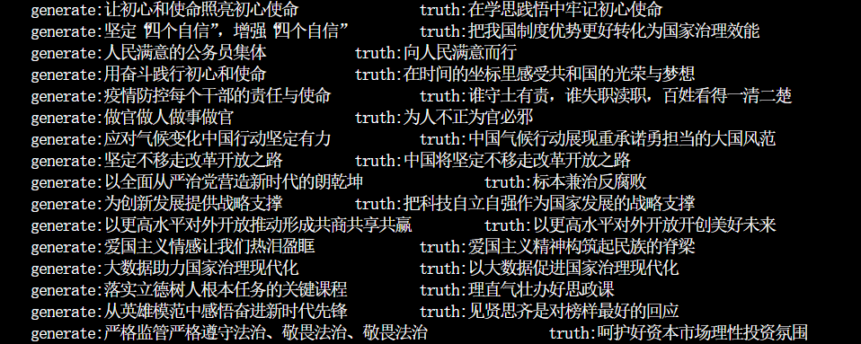

## 标题生成

### 项目描述

根据文章内容生成文章标题

### 环境配置

Python 版本：3.8
PyTorch 版本：1.10.0
CUDA 版本：11.3

所需环境在 `requirements.txt` 中定义。

### 数据

* 软件杯官方数据 http://www.cnsoftbei.com/plus/view.php?aid=729
* 开源摘要数据 https://zhuanlan.zhihu.com/p/341398288

### 目录结构

```
./
├── README.md
├── requirements.txt        # Python包依赖文件 
├── check/                  # 保存模型
├—— logs/                   # 保存tfevent文件
├── data/                   # 保存训练数据
│   ├── train.json
│   ├── dev.json
│   ├── ...
├── vocab/                  # 词表目录
│   ├── vovab.txt      # 用于构建tokenizer的词表
├—— config/   
│   ├── config.json         # 模型配置
├── src/                    # 核心代码
│   ├── config.py      # 模型、训练参数
│   ├── dataset.py     # 数据集
│   ├── finetune.py    # 微调
│   ├── generate.py    # 测试生成
│   ├── model.py       # 模型定义
│   ├── train.py       # 训练
│   ├── utils.py       # 工具函数
```

```
注：vocab.txt来自 https://huggingface.co/hfl/chinese-macbert-base/blob/main/vocab.txt
```

### 模型

* GPT2
  

```
    注：
    1. N、M分别为内容和标题的最大长度。若超过最大长度，标题直接按最大长度截断，内容则分别截取最大长度一半的开头和结尾。  
    2. [Conetent] 和 [Title] 为添加的特殊字符，用于区分内容和标题片段。
```

* Loss
  

### 生成测试

    

### 运行流程

```
训练 -> 微调 -> 测试
```

```shell
pip install -r requirements.txt
python src/train.py
python src/finetune.py
python src/generate.py 
```
